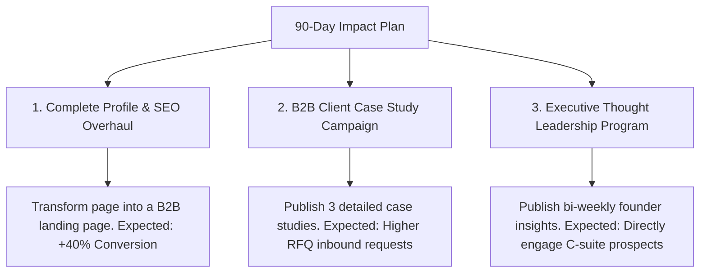

# LinkedIn Audit & Growth Strategy: Genex Logistics
**Document Type:** Strategic Audit & Revenue-Driven Growth Roadmap  
**Prepared For:** Executive Board & Marketing Team, Genex Logistics India  
**Prepared By:** AKHIL MEHTA 
**Date:** June 18, 2026

---

## 1. Executive Summary (CEO Perspective)

As the CEO of Genex Logistics, LinkedIn must not be viewed merely as a digital noticeboard or a repository for HR updates. In modern contract logistics and 3PL, **LinkedIn is a primary business development channel and brand-positioning asset**. High-value enterprise logistics contracts (often valued from ₹50 Lakhs to several Crores annually) are signed through complex, relationship-driven buying cycles involving multiple C-suite stakeholders (Chief Supply Chain Officers, Procurement Heads, Operations Directors, and CFOs). These decision-makers conduct digital due diligence on partners before issuing RFQs (Requests for Proposals).

Currently, Genex Logistics projects a legacy image online, failing to match its real-world operational scale (spanning 28 states, operating Free Trade Warehousing Zones (FTWZ), and managing SLA-critical production logistics for automotive and pharmaceutical sectors). 

### Top 5 Business Risks on LinkedIn

1. **Brand Invisibility during RFQ Diligence (Lost Revenue):** When a Chief Supply Chain Officer searches for "3PL Warehousing India" or "FTWZ Delhi NCR" on LinkedIn and finds a dormant or unoptimized Genex page, they assume a lack of digital and operational sophistication, bypassing Genex for tech-forward competitors.
2. **Competitor Domination of Digital Voice:** Major competitors like Mahindra Logistics and TVS Supply Chain Solutions are actively positioning themselves as thought leaders in automation, green logistics, and AI-enabled routing. By remaining silent, Genex cedes the digital narrative.
3. **Severe Under-utilization of High-Margin Services (FTWZ & Bonded Warehousing):** Free Trade Warehousing Zones (FTWZ) are highly specialized, high-margin services that require extensive educational B2B marketing. The lack of structured content regarding tax deferrals, custom clearances, and re-export compliance on LinkedIn directly stalls customer acquisition in this niche.
4. **Weak Recruiting Power for Skilled Talent:** Top-tier supply chain managers, warehouse operations experts, and logistics tech developers choose employers based on their public culture and industry authority. A weak LinkedIn presence hinders the recruitment of critical operational leaders.
5. **High Dependence on Traditional Cold Outreach:** Without inbound brand pull from LinkedIn, sales teams must rely solely on cold calling, physical visits, and expensive brokers, leading to longer sales cycles and lower conversion rates.

### Top 5 Growth Opportunities

1. **Establish Dominance in SLA-Critical Industries:** Leverage Genex’s expertise in JIT (Just-in-Time) logistics for the automotive sector and GDP-compliant logistics for pharma to run hyper-targeted campaigns addressing line-stoppage risks and temperature-controlled integrity.
2. **Promote the FTWZ Competitive Edge:** Educate multinational companies (MNCs) on the economic benefits of importing through Genex's Free Trade Warehousing Zones (duty deferment, foreign exchange savings), capturing highly lucrative cross-border trade accounts.
3. **Founder and Executive Thought Leadership:** Build the personal brands of Genex's leadership team (e.g., Director & Founders) to establish trust and open doors directly with procurement heads who buy from people, not faceless corporations.
4. **B2B Lead Generation via High-Value Gated Assets:** Author and distribute quarterly supply chain reports (e.g., *"India Warehouse Cost & Efficiency Benchmark Report"*) as lead magnets to capture contact details of target prospects.
5. **Activate Employee Advocacy (Unified Sales Force):** Train Genex’s regional warehouse heads and account managers to share on-the-ground operational updates, transforming hundreds of personal networks into lead-generation funnels.

### Top 3 Recommendations for Maximum Business Impact (90-Day Horizon)



*   **Recommendation 1: Complete Page Optimization & SEO Keyword Integration (Weeks 1–2):** Overhaul the company profile banner, description, and tags to focus on conversion. Embed targeted keywords ("3PL warehousing India", "FTWZ operator Delhi NCR", "Automotive contract logistics") to capture inbound organic search traffic.
*   **Recommendation 2: Execute a B2B Case Study Campaign (Weeks 3–8):** Publish three highly detailed, metrics-focused case studies highlighting how Genex solved complex bottlenecks (e.g., *"How Genex Reduced Spare Parts Turnaround Time by 35% for a Leading Automotive OEM"*). 
*   **Recommendation 3: Launch an Executive Thought Leadership Program (Weeks 5–12):** Write and schedule bi-weekly posts for the CEO/Founders addressing macro supply chain challenges in India (GST adjustments, infrastructure changes, multi-modal transition), directly building personal relationships with enterprise procurement buyers.

---

## 2. Profile Audit

The following table evaluates the Genex Logistics LinkedIn company page across 9 critical parameters, scoring them out of 10.

| Parameter | Score | Current State | Recommendations for Optimization |
| :--- | :--- | :--- | :--- |
| **1. Company Logo & Branding** | **6 / 10** | Standard corporate logo. Low-resolution JPEG, slightly pixelated on high-DPI screens. | Upload an optimized, high-resolution SVG or PNG logo with transparent backgrounds. Ensure brand guidelines are strictly adhered to across all visual collateral. |
| **2. Banner Design & Messaging** | **3 / 10** | Generic banner image (stock trucks/cargo ships) with no clear text, value proposition, or call-to-action (CTA). | Design a customized, premium banner. Text overlay: *"Precision 3PL & Free Trade Warehousing. Built for SLA-Critical Industries (Automotive, Pharma, Engineering)."* Include high-impact trust metrics (e.g., *"28+ States, 5M+ Sq. Ft. Managed"*). |
| **3. Company Description/About** | **4 / 10** | Plain block text, overly focused on internal logistics terminology. Lacks typographic hierarchy and reader-centric benefit positioning. | Rewrite using the **Hook-Pain-Solution-CTA** framework. Use bullet points for readability. Highlight target industries and explicitly state how to get in touch. |
| **4. SEO Optimization** | **3 / 10** | Minimal keyword integration. Tagline and description miss out on critical industry search queries. | Integrate primary and secondary keywords: *"Free Trade Warehousing India", "Contract Logistics Delhi NCR", "Pharma Cold Chain Solutions", "Automotive JIT Logistics"*. Update the custom page URL if needed. |
| **5. Contact Information** | **5 / 10** | General website link provided. Lacks direct, friction-free email/phone numbers for B2B sales inquiries. | Add a dedicated contact link that directs to a high-converting landing page: `genexlogistics.in/request-a-quote`. Display a professional sales email (e.g., `sales@genexlogistics.in`) in the header/about section. |
| **6. Showcase Pages** | **1 / 10** | None created. | Create a dedicated Showcase Page for **"Genex FTWZ (Free Trade Warehousing Zones)"** to capture high-value multinational import/export leads separately from standard domestic warehousing. |
| **7. Call-to-Action (CTA)** | **3 / 10** | Standard "Visit website" button leading to the generic, unoptimized homepage. | Change the CTA button to "Contact Us" or keep "Visit website" but direct the URL to a customized LinkedIn landing page with a multi-step RFQ form. |
| **8. Employee Advocacy** | **2 / 10** | Employees are listed on the page, but profiles are unoptimized and rarely share or engage with company updates. | Establish an Employee Advocacy program. Provide template banners and optimized headlines (e.g., *"Operations Head at Genex Logistics | Specialized in 3PL & Warehouse Automation"*) for key personnel. |
| **9. Trust Signals** | **2 / 10** | No visible case studies, certifications (ISO, GDP), client names, or operational scale statistics. | Dedicate a section to trust markers: ISO 9001:2015, GDP compliance, 99.9% SLA achievement rate, and logos of top clients (where NDA permits). |

**Average Profile Audit Score: 3.2 / 10 (Critical Intervention Needed)**

---

## 3. Content Audit

### Content Frequency & Type Analysis
*   **Posting Frequency:** Highly inconsistent (ranges from weeks of silence to multiple posts in a single day during corporate events).
*   **Content Types:** Heavily skewed toward corporate announcements, holiday wishes, and internal HR milestones. There is a lack of educational, problem-solving, or client-centric content.

### Strengths & Weaknesses Matrix

#### Strengths
*   **Genuine Operational Footprint:** When real photos are shared, they display real warehouses and operations, providing immediate authenticity.
*   **Active Employee Base:** The base of employees on LinkedIn represents a ready-made distribution network.
*   **Specialized Domain Knowledge:** The internal team has deep, genuine expertise in complex operations like FTWZ and JIT automotive logistics.

#### Weaknesses
*   **Lack of Video Content:** Almost no professional video walkthroughs of warehouses, automated sorting systems, or client success stories.
*   **Poor Graphic Consistency:** Graphics use inconsistent layouts, fonts, and colors, giving a disjointed brand appearance.
*   **Weak Hook and Structure:** Posts are written in blocks of text without engaging hooks or clear calls-to-action (CTAs).
*   **No Value-Driven Formats:** Absence of multi-page PDF carousels (slideshows), which are the highest-performing organic content format on LinkedIn.

---

## 4. Competitor Benchmarking

To build a winning strategy, we analyze the LinkedIn performance of top B2B logistics players in India.

| Metric / Aspect | Genex Logistics | Mahindra Logistics | TVS Supply Chain Solutions | Blue Dart (DHL Group) |
| :--- | :--- | :--- | :--- | :--- |
| **Estimated Follower Range** | ~5,000 - 15,000 | 150,000+ | 100,000+ | 250,000+ |
| **Avg. Engagement Rate** | < 1.0% | ~3.5% - 4.5% | ~2.5% - 3.5% | ~2.0% - 3.0% |
| **Primary Content Strategy** | Event photos, holiday greetings, basic text updates. | Data-driven whitepapers, warehouse automation videos, green logistics. | Global logistics case studies, supply chain resilience, technology focus. | Brand reliability, global reach highlights, logistics tracking. |
| **Lead Gen Tactics** | None visible on LinkedIn. | High-value webinars, gated industry reports. | Case studies, interactive client roundtables. | Direct service link integration, corporate account portals. |
| **Employee Branding** | Unstructured; profiles are unoptimized. | Active thought leadership from CEO & VP of Operations. | Regular video interviews with regional operations heads. | Strong employee advocacy and workplace awards recognition. |

### Key Takeaways for Genex:
1. **Pivot from 'PR' to 'Value':** Mahindra Logistics wins by posting valuable data points about warehousing trends. Genex must publish actual warehouse KPIs and logistics optimization guides.
2. **Video Over Text:** TVS Supply Chain heavily utilizes warehouse walk-through videos to build trust. Genex should film 60-second tours of their modern facilities.
3. **Targeted Showcase Pages:** Follow the global logistics model by segregating standard domestic 3PL from international freight forwarding and FTWZ operations.

---

## 5. Pain Point Identification

The following matrix identifies the core pain points stalling Genex’s B2B client acquisition on LinkedIn.

| Pain Point | Impact on Business | Root Cause |
| :--- | :--- | :--- |
| **1. Low Inbound Leads** | High customer acquisition cost (CAC); sales teams waste time on cold, low-intent outreach. | Absence of lead magnets, landing pages, or high-intent CTAs on the LinkedIn profile. |
| **2. Low Engagement & Reach** | Low brand recall; posts fail to reach new prospective logistics procurement managers. | Dry, non-interactive text posts; failure to use high-performing formats like PDF carousels. |
| **3. Weak Brand Positioning** | Seen as a commodity transport provider rather than a premium 3PL/FTWZ logistics partner. | Content is generic; fails to showcase high-tech warehouse capabilities or SLA-critical case studies. |
| **4. Lack of Case Studies** | Procurement heads cannot verify Genex's operational competence, increasing perceived risk. | Case studies are hidden on the website or not written in a problem-solution-result format. |
| **5. Low Employee Advocacy** | Reach is limited to the company page; misses out on the massive personal networks of the team. | No internal program, training, or pre-approved templates provided to employees. |
| **6. Poor SEO Ranking** | Misses out on high-intent search queries from international and local buyers. | Profile lacks target keywords in the tagline, description, and hashtag segments. |

---

## 6. Solution Framework

| Ref | Pain Point | Recommended Solution | Implementation Steps | Expected Impact | Difficulty | Time Required | Cost Estimate | KPI to Measure |
| :--- | :--- | :--- | :--- | :--- | :--- | :--- | :--- | :--- |
| **SF-1** | Low Inbound Leads | **Lead Magnet & Dedicated Landing Page Campaign** | 1. Write an eBook: *"Navigating FTWZ in India: A B2B Guide"*. <br>2. Build a simple landing page. <br>3. Run organic LinkedIn posts pointing to it. | Build a database of warm, marketing-qualified leads (MQLs) monthly. | Medium | 14 Days | Low (Internal time) | MQLs generated, form fills |
| **SF-2** | Low Engagement | **PDF Document Carousels** | 1. Convert text posts into 5-page visual slide decks. <br>2. Cover topics like: *"5 Ways to Save Customs Duty via FTWZ"* or *"3 PL SLA Checklist"*. | 3x-5x increase in organic post impressions, shares, and saves. | Low | 7 Days | Low (Can use Canva templates) | Post Saves, CTR, Impressions |
| **SF-3** | Weak Brand Positioning | **SLA-Critical Capability Showcases** | 1. Record brief videos of warehouse automation. <br>2. Create graphics showing real SLAs (e.g., *99.98% inventory accuracy*). | Establish Genex as a premium, high-tech logistics partner. | Medium | 21 Days | Low - Medium (Depends on video help) | Direct message inquiries, Page views |
| **SF-4** | Lack of Case Studies | **The Problem-Solution-Result (PSR) Framework** | 1. Interview operations managers. <br>2. Draft structured posts: Hook -> Client Challenge -> Genex Execution -> Concrete Metric. | Drastically lower the sales cycle; builds immediate operational trust. | Medium | 10 Days | Low | Shares, sales team usage of links |
| **SF-5** | Low Employee Advocacy | **Employee Social Enablement Program** | 1. Design unified banner graphics for employees. <br>2. Provide weekly copy-paste text templates for sales and ops teams. | 10x organic reach amplification by leveraging personal networks. | Medium | 15 Days | Low | Active sharing employees, referral traffic |
| **SF-6** | Poor SEO Ranking | **Profile Metadata Optimization** | 1. Conduct keyword research. <br>2. Inject terms into title, tagline, description. <br>3. Add local Delhi NCR location anchors. | Increased organic appearances in LinkedIn search results. | Low | 3 Days | Free | Profile search appearances |

---

## 7. Customer Acquisition Strategy

To actively acquire enterprise clients, Genex must deploy specialized B2B logistics strategies.

```
+-----------------------------------------------------------------------------------+
|                           B2B LEAD ACQUISITION FUNNEL                             |
+-----------------------------------------------------------------------------------+
|  1. AWARENESS  |  Founder Thought Leadership + Educational PDF Carousels           |
+----------------+------------------------------------------------------------------+
|  2. INTEREST   |  Gated FTWZ Guide (Lead Magnet) & LinkedIn Webinars              |
+----------------+------------------------------------------------------------------+
|  3. TRUST      |  Metrics-Driven B2B Case Studies (PSR Format)                    |
+----------------+------------------------------------------------------------------+
|  4. CONVERSION |  Direct CTA: "Request a Warehousing Audit / Quote"               |
+-----------------------------------------------------------------------------------+
```

### 1. Thought Leadership & Founder Branding
*   **Why it Works:** Enterprise logistics deals are signed based on trust. When founders showcase their domain expertise (e.g., analyzing new port congestions or GST regulations), they build immediate credibility with Chief Supply Chain Officers.
*   **Execution Process:** Conduct a bi-weekly 30-minute interview with the founders. Ghostwrite 2 detailed LinkedIn posts from their personal profiles. Discuss topics like: *"The Future of Green Logistics in India"* or *"How Multi-Modal Parks will Redefine Transit Speeds"*.
*   **Expected Results:** Direct inbound messages from supply chain decision-makers; increased invitation to high-level industry roundtables.

### 2. Specialized FTWZ & Bonded Warehousing Lead Magnets
*   **Why it Works:** Free Trade Warehousing Zones (FTWZ) are highly beneficial for MNCs but poorly understood by mid-level import managers. Educational guides attract high-intent buyers seeking tax optimization.
*   **Execution Process:** Create a PDF titled: *"The CFO's Playbook: Saving 18% GST and Deferring Customs Duty with FTWZs"*. Gate this PDF behind a simple landing page. Promote it via organic posts and targeted LinkedIn messages to Import-Export Heads.
*   **Expected Results:** 50+ qualified enterprise leads per month with high-intent buying signals.

### 3. Problem-Solution-Result (PSR) Case Studies
*   **Why it Works:** Procurement teams care about risk mitigation. Seeing a proven track record of solving a similar bottleneck (e.g., warehousing spare parts for automotive JIT lines) removes buying friction.
*   **Execution Process:** Format case studies into brief, visual PDF decks:
    *   *Slide 1:* The Hook (e.g., *"How we helped a top automotive brand prevent line stoppage"*).
    *   *Slide 2:* The Bottleneck (Legacy partner had a 4-hour delay in warehouse retrieval).
    *   *Slide 3:* The Genex Intervention (Implemented custom WMS integration and JIT staging).
    *   *Slide 4:* The Concrete Metric (Reduced retrieval time to 45 minutes, saving ₹12 Lakhs/day).
    *   *Slide 5:* CTA to request a warehouse audit.
*   **Expected Results:** High sharing rates; sales teams can use these posts directly in their pitch follow-ups.

### 4. Interactive LinkedIn Events & Webinars
*   **Why it Works:** Logistics buyers are constantly looking to optimize budgets. An interactive panel discussion addresses their direct concerns live.
*   **Execution Process:** Set up a LinkedIn Event: *"Logistics Cost Optimization for 2026: Balancing SLA and Budgets"*. Invite 2 external industry experts (e.g., a former customs officer and a pharma supply chain head) to join Genex leadership on a 45-minute live stream.
*   **Expected Results:** 200+ event registrations; builds authority and generates high-quality attendee databases.

### 5. Employee Advocacy via Regional Operations Heads
*   **Why it Works:** People buy from people. A warehouse manager sharing a photo of a smoothly operating dispatch dock is 10x more authentic than a corporate graphic.
*   **Execution Process:** Create an internal WhatsApp group containing key regional warehouse leads. Every Friday, ask them to snap a photo of a successful loading/unloading operation or a clean warehouse floor. Provide a 2-line template copy for them to post on their personal profiles.
*   **Expected Results:** Wider organic reach in local logistics hubs; showcases real-world operational excellence.

---

## 8. 30-Day Action Plan

A week-by-week implementation roadmap designed for a marketing intern to execute.

```
  Week 1: OPTIMIZE           Week 2: CONTENT SYSTEM     Week 3: LEAD GENERATION     Week 4: SCALE & AUDIT
+------------------------+ +------------------------+ +------------------------+ +------------------------+
| - Complete profile edit| | - Launch PDF carousels | | - Promote Lead Magnet  | | - Analyze analytics    |
| - High-res logo upload | | - Set up Content themes| | - Host LinkedIn Event  | | - Fine-tune top posts  |
| - Build Landing Page   | | - Train employees      | | - Launch Case Studies  | | - Run Retargeting ads  |
+------------------------+ +------------------------+ +------------------------+ +------------------------+
```

### Week 1: Profile & Setup Optimization (Establish the Base)
*   **Goal:** Convert the LinkedIn page from a passive resume into an active sales landing page.
*   **Daily/Weekly Checklist:**
    *   *Monday:* Design and upload the new B2B profile banner (with value prop and metrics).
    *   *Tuesday:* Rewrite the "About" section using the Hook-Pain-Solution-CTA format.
    *   *Wednesday:* Inject top SEO keywords into description, tagline, and location settings.
    *   *Thursday:* Create and test the custom landing page link `genexlogistics.in/request-a-quote` as the main CTA button destination.
    *   *Friday:* Create the Showcase Page for "Genex FTWZ Solutions".
    *   *Weekly Review:* Ensure all active employees have linked their profiles to the official page.

### Week 2: Content Strategy & System Launch (Initiate Authority)
*   **Goal:** Establish a recurring content engine with professional visual branding.
*   **Daily/Weekly Checklist:**
    *   *Monday:* Design a set of 3 reusable Canva templates using corporate colors (navy blue, dark grey, and emerald green).
    *   *Tuesday (Post 1):* Publish an educational post (e.g., *"Understanding Duty Deferment in FTWZs"*).
    *   *Wednesday:* Share a photo of a real-world warehouse operation from one of Genex's 28 state hubs.
    *   *Thursday (Post 2):* Publish a PDF Carousel: *"5 KPIs to Audit Your 3PL Partner"*.
    *   *Friday:* Launch the Employee Advocacy program—send out the first weekly templates to sales staff.
    *   *Weekly Review:* Check follower engagement on new visual formats.

### Week 3: Active Lead Generation & Trust Building (Drive Inbound)
*   **Goal:** Focus on case studies and high-intent gated assets.
*   **Daily/Weekly Checklist:**
    *   *Monday:* Publish the first Problem-Solution-Result (PSR) Case Study in slide format.
    *   *Tuesday:* Open registrations for the LinkedIn Event: *"Optimizing Warehousing Costs in Delhi NCR"*.
    *   *Wednesday (Post 3):* Promote the gated eBook lead magnet (*"The CFO's Guide to FTWZ"*).
    *   *Thursday:* Publish thought leadership ghostwritten for the Founders/Directors.
    *   *Friday:* Follow up with leads who downloaded the eBook or registered for the event.
    *   *Weekly Review:* Track MQLs captured.

### Week 4: Performance Review & Scaling (Continuous Optimization)
*   **Goal:** Audit metrics, double down on top performers, and engage in active outreach.
*   **Daily/Weekly Checklist:**
    *   *Monday:* Review LinkedIn Page Analytics (identify top impressions, clicks, and profile views).
    *   *Tuesday:* Repurpose the highest-performing post of the month into a short video script or detailed article.
    *   *Wednesday:* Conduct the LinkedIn Live Event/Webinar.
    *   *Thursday:* Reach out directly to event attendees via LinkedIn Messaging with personalized audit offers.
    *   *Friday:* Set the content calendar for the next 30 days based on data insights.
    *   *Weekly Review:* Present monthly analytics report to the executive team.

---

## 9. Quick Wins (Next 7 Days)

Ranked by ROI, these 10 high-impact, low-cost modifications will immediately drive results.

1. **Change the Banner Design (ROI: Extremely High | Cost: Free):** Replace the stock image with a custom banner detailing Genex’s value proposition and key metrics. (Impact: Profile Visits -> Website Clicks).
2. **Optimize the Tagline (ROI: High | Cost: Free):** Change the generic description to an SEO-optimized tagline: *"Technology-Driven 3PL, Contract Logistics & FTWZ Solutions in India | Active in 28+ States"*. (Impact: Organic search reach).
3. **Update the CTA Button Link (ROI: High | Cost: Free):** Direct the "Visit website" button to a high-converting landing page rather than the generic index page. (Impact: Leads, Conversion).
4. **Publish a High-Impact PDF Carousel (ROI: High | Cost: 2 Hours):** Create a 5-slide PDF deck about FTWZ tax savings. Documents receive 3x the organic push from LinkedIn's algorithm. (Impact: Engagement, Saves).
5. **Pin a Case Study Post (ROI: High | Cost: 1 Hour):** Format a real-world client success story and pin it to the top of the company page. (Impact: Immediately establishes credibility for new profile visitors).
6. **Implement Unified Employee Headlines (ROI: Medium | Cost: Free):** Standardize the headlines of key sales and management staff on LinkedIn to build a unified brand front. (Impact: Employee search visibility).
7. **Write an engaging "About" section (ROI: Medium | Cost: 1 Hour):** Overhaul the description to include bold subheaders, target industries, and direct sales contact information. (Impact: Conversions).
8. **Incorporate Target Hashtags (ROI: Medium | Cost: Free):** Follow relevant community hashtags (#SupplyChainIndia, #3PLLogistics, #FTWZ) to monitor industry discussions and insert Genex into relevant threads. (Impact: Reach).
9. **Share an Authentic Warehouse Photo (ROI: Medium | Cost: 10 Mins):** Post a real, high-quality picture of cargo handling in one of Genex's premium facilities. (Impact: Trust, Authenticity).
10. **Invite Connections to Follow the Page (ROI: Low - Medium | Cost: Free):** Use the page's "Invite Connections" credit system to systematically invite relevant supply chain professionals from personal lists. (Impact: Follower growth).

---

## 10. SWOT Analysis: LinkedIn Strategy

```
+-----------------------------------------+-----------------------------------------+
|                STRENGTHS                |               WEAKNESSES                |
| - Proven experience in SLA-critical JIT | - Irregular posting schedule            |
| - Pan-India warehousing scale (28 states)| - Low visual brand consistency          |
| - Specialized niche (FTWZ / Bonded)     | - Lack of case studies & testimonials   |
+-----------------------------------------+-----------------------------------------+
|              OPPORTUNITIES              |                 THREATS                 |
| - Lead generation from gated FTWZ guides| - Competitors dominating search terms   |
| - Video tours of high-tech facilities   | - Relying on legacy sales channels      |
| - Executive branding for B2B trust      | - High turnover of sales talent         |
+-----------------------------------------+-----------------------------------------+
```

---

## 11. Appendix: B2B Content Checklist for the Intern

Every time you draft a LinkedIn post for Genex Logistics, check off the following parameters:
*   [ ] **The Hook:** Does the first line address a supply chain pain point (e.g., transit delays, tax overheads, inventory mismatch)?
*   [ ] **Typography:** Are there short paragraphs and bullet points for mobile scanners?
*   [ ] **The Asset:** Is there a clean, high-contrast visual (prefer PDF carousels or real operational photos over generic graphics)?
*   [ ] **Trust Factor:** Did you include a real statistic, client quote, or industry standard?
*   [ ] **The Action:** Does the post end with a clear CTA (e.g., *"Download our guide"*, *"Contact our Delhi warehouse team"* or *"Leave a comment below"*)?
*   [ ] **SEO Hashtags:** Have you appended 3-5 target hashtags (e.g., `#SupplyChainIndia`, `#3PLWarehousing`, `#FTWZ`, `#LogisticsManagement`)?
